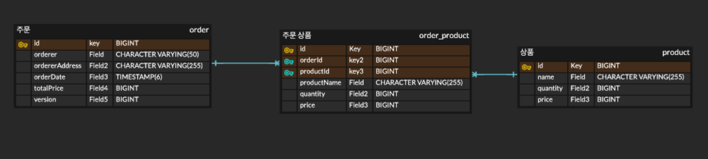

# 팀프레시 WMS 스쿼트 백엔드 과제

## 요구사항
- 단건 API 주문 등록, Excel 주문 등록
  - 기능 상세
    - 상품, 주문 수량, 주문자 정보를 토대로 주문을 생성합니다.
    - 1개의 주문은 1개의 고유값으로 구분할 수 있어야 합니다.
  - 입력 상세
    - 상품명, 상품 PK, 상품별 주문 수량, 주문자명, 주문자 주소
    - 상품과 수량정보는 리스트 형태로 작성되어야 합니다.
  - 동시 주문을 막기 위한 분산락 적용
    - 분산락의 범위 및 적용 형태는 지원자님의 판단에 따릅니다.
---
## 제약사항
- JAVA 8이상 사용
- Spring Boot 사용
- DB는 인메모리 DB를 사용하며 DB컨트롤은 JPA로 구현
- 욉 라이브러리 및 오픈소스 사용가능
---
## 프로젝트 스펙
- JAVA 21
- Spring Boot 3.4.3
- H2 DB 2.3.232
- Spring Data Jpa 3.4.3
---
## UBIQUITOUS LANGUAGE
### Order(주문)

### Product(상품)
- name: 상품명
- amount: 재고량
---
## Bounded Context
### Order
- 주문에 대한 책임을 담당합니다.
- 단건 주문 및 Excel 주문을 수행합니다.
- 주문시에 상품들을 주문할 수 있습니다.( 요구사항의 상품과 수량정보는 리스트 형태로 작성될것 ) 
### Product
- 상품 관리 책임을 담당합니다. 
- Id, Name, Amount을 가지며, 상품의 정보 및 재고량을 관리합니다.
---
# API 명세서
[Product.http](./http/Product.http)  
[Order.http](./http/Order.http)
## 1. 상품 생성 API

- **요청 URL**: `/api/product`
- **HTTP 메서드**: `POST`
- **요청 형식**: JSON
- **요청 본문**:
    ```json
    {
        "name": "상품 이름",
        "quantity": 10,
        "price": 1000
    }
    ```
- **요청 설명**:
  - `name`: 상품 이름 (필수)
  - `quantity`: 상품 수량
  - `price`: 상품 가격

- **응답 형식**: 없음
- **응답 상태 코드**: `200 OK`
- **응답 설명**: 상품이 정상적으로 생성되었습니다.

- **에러 응답**:
  - **400 Bad Request**: 잘못된 요청

---

## 2. 상품 조회 API

- **요청 URL**: `/api/product/{productId}`
- **HTTP 메서드**: `GET`
- **요청 파라미터**:
  - `productId`: 조회할 상품의 ID (필수)

- **응답 형식**: JSON
- **응답 본문**:
    ```json
    {
        "id": 1,
        "name": "상품 이름",
        "quantity": 10,
        "price": 1000
    }
    ```
- **응답 설명**:
  - `id`: 상품 ID
  - `name`: 상품 이름
  - `quantity`: 상품 수량
  - `price`: 상품 가격

- **응답 상태 코드**: `200 OK`
- **에러 응답**:
  - **404 Not Found**: 상품이 존재하지 않는 경우

---

## 3. 모든 상품 조회 API

- **요청 URL**: `/api/product`
- **HTTP 메서드**: `GET`
- **요청 형식**: 없음

- **응답 형식**: JSON 배열
- **응답 본문**:
    ```json
    [
        {
            "id": 1,
            "name": "상품 이름",
            "quantity": 10,
            "price": 1000
        },
        {
            "id": 2,
            "name": "다른 상품",
            "quantity": 5,
            "price": 500
        }
    ]
    ```

- **응답 상태 코드**: `200 OK`
- **에러 응답**: 없음

---

## 4. 상품 수량 증가 API

- **요청 URL**: `/api/product/increase`
- **HTTP 메서드**: `PATCH`
- **요청 형식**: JSON
- **요청 본문**:
    ```json
    {
        "productId": 1,
        "quantity": 5
    }
    ```
- **요청 설명**:
  - `productId`: 수량을 증가시킬 상품 ID (필수)
  - `quantity`: 증가시킬 수량 (필수)

- **응답 형식**: 없음
- **응답 상태 코드**: `200 OK`
- **응답 설명**: 상품의 수량이 성공적으로 증가했습니다.

- **에러 응답**:
  - **400 Bad Request**: 잘못된 요청
  - **404 Not Found**: 해당 상품이 존재하지 않음
  
---

## 5. 주문 생성 API

- **요청 URL**: `/api/order`
- **HTTP 메서드**: `POST`
- **요청 형식**: JSON
- **요청 본문**:
```json
  {
      "orderer": "홍길동",
      "ordererAddress": "서울특별시 강남구",
      "orderProducts": [
        {
          "productId": 1,
          "productName": "노트북",
          "quantity": 2,
          "price": 100
        },
        {
          "productId": 2,
          "productName": "무선 마우스",
          "quantity": 1,
          "price": 100
        }
      ]
  }
```
- **요청 설명**:
  - `orderer`: 주문자명 (필수)
  - `ordererAddress`: 주문자 주소 (필수)
  - `orderProducts`: 주문 상품들 (필수)
    - `productId`: 주문 상품 PK (필수)
    - `productName`: 주문 상품명 (필수)
    - `quantity`: 주문 상품 수량 (필수)
    - `price`: 주문 상품 개별 가격

- **응답 형식**: 없음
- **응답 상태 코드**: `200 OK`
- **응답 설명**: 주문이 성공적으로 등록되었습니다.

- **에러 응답**:
  - **400 Bad Request**: 잘못된 요청, 주문한 상품이 잘못된 경우
  - **404 Not Found**: 해당 상품이 존재하지 않음
  
---

## 6. excel로 주문 생성 API

- **요청 URL**: `/api/order/excel/upload`
- **HTTP 메서드**: `POST`
- **요청 형식**: MultiPart
- **요청 본문**:
```json
  {
      "orderer": "홍길동",
      "ordererAddress": "서울특별시 강남구",
      "excel": file
  }
```
- **요청 설명**:
  - `orderer`: 주문자명 (필수)
  - `ordererAddress`: 주문자 주소 (필수)
  - `excel`: 주문 상품정보 [sample excel](./src/main/resources/sample/store_order_excel_ssample.xlsx)

- **응답 형식**: 없음
- **응답 상태 코드**: `200 OK`
- **응답 설명**: 주문이 성공적으로 등록되었습니다.

- **에러 응답**:
  - **400 Bad Request**: 잘못된 요청, 주문한 상품이 잘못된 경우
  - **404 Not Found**: 해당 상품이 존재하지 않음

---

## 7. 주문 조회 API

- **요청 URL**: `/api/order/{orderId}`
- **HTTP 메서드**: `GET`
- **요청 파라미터**:
  - `orderId`: 조회할 주문의 ID (필수)
- **응답 형식**: JSON
- **응답 본문**:
```json
  {
      "id": 1,
      "orderer": "홍길동",
      "ordererAddress": "서울특별시 강남구",
      "totalPrice": 300,
      "orderProducts": [
        {
          "productId": 1,
          "productName": "노트북",
          "quantity": 2,
          "price": 100
        },
        {
          "productId": 2,
          "productName": "무선 마우스",
          "quantity": 1,
          "price": 100
        }
      ]
  }
```
- **응답 설명**:
  - `id`: 주문 ID
  - `orderer`: 주문자명
  - `ordererAddress`: 주문자 주소
  - `totalPrice`: 총 주문 금액
  - `orderProducts`: 주문 상품들
    - `productId`: 상품 ID
    - `productName`: 상품명
    - `quantity`: 수량
    - `price`: 개별 가격

- **응답 상태 코드**: `200 OK`
- **에러 응답**: 없음

---

## 에러 코드 목록

- **400 Bad Request**: 잘못된 요청
- **404 Not Found**: 요청한 리소스가 없음
- **500 Internal Server Error**: 서버 오류 발생 시

---

## API 요약

| **API**          | **HTTP Method** | **URL**                    | **Description** | **Status Code** | **Request Body**                                                                | **Response**                                                   |
|------------------|-----------------|----------------------------|-----------------|-----------------|---------------------------------------------------------------------------------|----------------------------------------------------------------|
| **상품 생성**        | `POST`          | `/api/product`             | 상품 생성           | `200 OK`        | `{ "name": "상품 이름", "quantity": 10, "price": 1000 }`                            | 없음                                                             |
| **상품 조회**        | `GET`           | `/api/product/{productId}` | 특정 상품 조회        | `200 OK`        | 없음                                                                              | `{ "id": 1, "name": "상품 이름", "quantity": 10, "price": 1000 }`  |
| **모든 상품 조회**     | `GET`           | `/api/product`             | 모든 상품 조회        | `200 OK`        | 없음                                                                              | `[ { "id": 1, "name": "상품 이름", "quantity": 10, "price": 1000 }, ... ]` |
| **상품 수량 증가**     | `PATCH`         | `/api/product/increase`    | 상품 수량 증가        | `200 OK`        | `{ "productId": 1, "quantity": 5 }`                                             | 없음                                                             |
| **주문 생성**        | `POST`          | `/api/order`               | 주문 생성           | `200 OK`        | `{"orderer": "주문자명", "ordererAddress": "주문자 주소", "orderProducts: [주문 상품들...]"}` | 없음                                                             |
| **excel로 주문 생성** | `POST`          | `/api/order/excel/upload`  | excel로 주문 생성    | `200 OK`        | Multipart                                                                       | 없음                                                             |
| **주문 조회**        | `GET`           | `/api/order/{orderId}`     | 특정 주문 조회        | `200 OK`        | 없음                                                                              | `{"id": 1, "orderer": "주문자명", "ordererAddress": "주문자 주소", "orderProducts: [주문 상품들...]"}` |


---

# ERD


